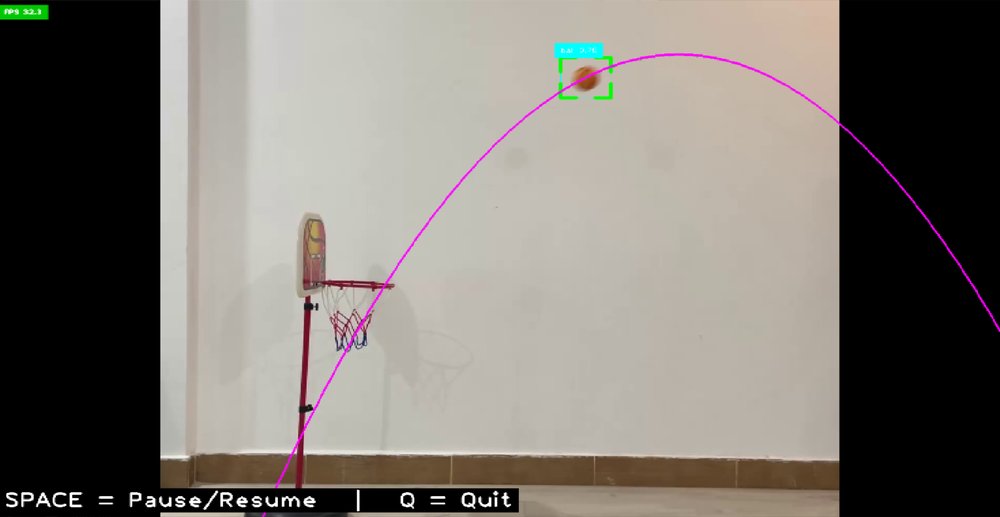

# Object Trajectory Prediction

## 📚 Educational Project: Quadratic Equations in Real-World Physics

This project demonstrates how quadratic equations apply to real-world physics by predicting the trajectories of moving objects (like balls) in video. It uses computer vision to track objects and polynomial regression to fit a parabolic curve to the tracked path, showing how the mathematical model y = ax² + bx + c relates directly to projectile motion.



## 🎯 Purpose

This project was created to show students how quadratic equations aren't just abstract concepts in textbooks but have practical applications in the real world. By visualizing the parabolic arc of a moving object and its predicted path, students can see mathematics in action.

## 📋 Features

- Real-time object detection and tracking
- Polynomial curve fitting to predict trajectories
- Bounce detection for trajectory reset
- Multiple implementation methods to demonstrate different computer vision approaches
- Visualization of past trajectory points and predicted path

## 🛠️ Implementations

This repo contains three different implementations of trajectory prediction:

1. **PolyTrajectory.py**: Simple implementation using manual ROI selection and traditional OpenCV trackers
2. **YoloTrajectory.py**: Object detection using YOLOv8 model
3. **rfdetrPrediction.py** and **objectTrajectoryPrediction.py**: Using RF-DETR detection model with ByteTrack for object tracking

## 🚀 Getting Started

### Prerequisites

```
pip install -r requirements.txt
```

Required packages:
- opencv-python
- numpy
- cvzone
- ultralytics (for YOLOv8)
- supervision
- rfdetr

### Data Files

Download the following files and place them in the appropriate directories:

- **Videos**: [Download Videos](https://drive.google.com/drive/folders/109N1-t68UZfEtdLT2k23h3sF6CvaO2N-?usp=sharing)
  - Place the downloaded videos in a folder named `Videos` in the project root

- **Model Weights**: [Download RF-DETR Weights](https://drive.google.com/file/d/1ktpPqfW9LSpzfn8GFVOB1GQ488CB6Igj/view?usp=sharing)
  - Place the checkpoint file in the project root directory

### Running the Applications

#### Simple Tracker (ROI-based):
```bash
python PolyTrajectory.py
```
- Instructions:
  - Press SPACE to advance through frames, ENTER to select a frame
  - Draw a region of interest (ROI) around the object to track
  - Press SPACE to pause/resume tracking, R to re-select ROI, Q to quit

#### YOLOv8-based Tracker:
```bash
python YoloTrajectory.py
```
- Instructions:
  - Press SPACE to pause/resume tracking, Q to quit

#### RF-DETR with ByteTrack:
```bash
python rfdetrPrediction.py
```
- Instructions:
  - Press SPACE to pause/resume tracking, Q to quit

#### Save Tracked Video:
```bash
python objectTrajectoryPrediction.py
```
- This script processes a video file and saves the output with trajectory visualization

## 📊 How It Works

1. **Object Detection/Tracking**: The system identifies the target object (e.g., a ball) in each video frame
2. **Data Collection**: Position data (x,y coordinates) is collected over multiple frames
3. **Bounce Detection**: When the object changes direction from downward to upward, the system resets tracking
4. **Polynomial Fitting**: Using the collected points, the system fits a quadratic equation (y = ax² + bx + c)
5. **Trajectory Prediction**: The fitted equation is used to predict and visualize the object's future path

## 🧮 The Math Behind It

The trajectory of a projectile under gravity (ignoring air resistance) follows a parabolic path described by a quadratic equation. In our implementation:

- x-axis: horizontal position
- y-axis: vertical position (increases downward in our coordinate system)
- Coefficients (a, b, c) from the polynomial fit directly relate to:
  - a: related to gravitational acceleration
  - b: related to initial horizontal velocity
  - c: initial position constant

## 🙏 Acknowledgments

Special thanks to:
- **Murtaza Hassan** and **Piotr Skalski** for their expertise and inspiration in computer vision
- The open-source communities behind OpenCV, YOLOv8, and RF-DETR

## 📝 Educational Note

This project provides a tangible connection between:
- Mathematical concepts (quadratic equations)
- Physics principles (projectile motion)
- Computer science techniques (computer vision, data fitting)

It demonstrates how interdisciplinary knowledge comes together to solve real-world problems.

## 🔧 Customization

- Change `VIDEO_SOURCE` in the scripts to use different videos or your webcam
- Adjust `CONF_THRESH` to modify detection confidence thresholds
- Modify `TARGET_CLASS` to track different objects based on the model's class IDs
